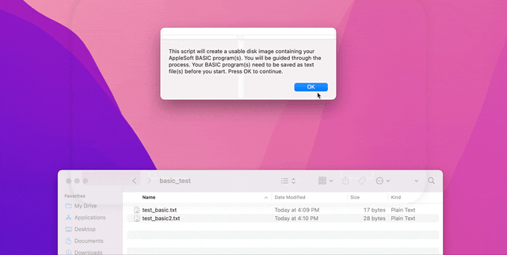

# Running AppleSoft BASIC from a modern mac on an Apple ][c

Figuring out how to run AppleSoft BASIC programs, written on a modern mac, on an original apple IIc.

Some solutions include keyboard emulators or modems, but this could require some intense hardware work. We are be better off packaging up programs as disk images which we then use with an emulated disk drive or transfer cable, or even writing our own physical floppies if we have a mechanism to write 5.25" floppies.

# AppleSoft BASIC

[Applesoft (integer) BASIC](https://en.wikipedia.org/wiki/Applesoft_BASIC) is a form of Microsoft BASIC written for the Apple I and II.

Example Hello World program:
```
10 PRINT "HELLO WORLD"
```

More example programs, including those used below can be found in this repo in the [applesoft_basic_programs](applesoft_basic_programs/) folder

# Writing disk images containing our program

AppleCommander is the standard for composing disk images and has some built-in libraries for dealing with AppleSoft BASIC. Although our program will be written in AppleSoft BASIC, it needs to be properly tokenized to be read by the Apple IIc. Thankfully, AppleCommander has a utility for loading plaintext BASIC into disk images: https://applecommander.github.io/ac/#put-standard-input-basic-source-code-onto-disk-image-as-a-basic-file.


## Converting a BASIC file to a disk image with the included script
We can add BASIC to be loaded 2 ways, either on a disk with DOS 3.3 Master preloaded, or on an empty DOS compatible disk. Generally, if we only have one disk drive (or disk drive emulator), we will want to go with option (1) since we will need the BASIC interpreter that comes with DOS

**I have included a very helpful AppleScript that automates this whole routine below. The applescript is located at `make_disk_image.scpt`.**



The script can be run from any clone of this repository on a mac. Java is required in order for the script to run, and the script will prompt you if it cannot find a java installation. 

### Java installation
Theoretically, the `ac` (commandline) version of applecommander is agnostic to OS, so this shouldn't matter; the included jar file should work on all systems with Java installed.

On a mac, you can use homebrew to install the java openjdk and test if the distributed jar is working (note we use the `ac` jar for command line version of applecommander)

```
brew install openjdk@11
```

Alternatively, you can install Java via the Java website. You may need to restart your system after java installation for everything to work properly


## Converting a BASIC file to a disk image without the included applescript
If you've used the applescript, skip to the next section, **Where To Run Your Disk Image**, below. 

Otherwise, you can follow the format of the commands below, executed in a shell terminal in the root of this repository, to build disk images.

### Adding images on top of DOS w/ Integer BASIC
```
# from the root of this repo
cp disk_images/reference/dos_3_3_master.dsk disk_images/created/helloworld_dos.dsk
cat applesoft_basic_programs/helloworld.bas | java -jar applecommander/AppleCommander-ac-1.8.0.jar -bas disk_images/created/helloworld_dos.dsk helloworld

# we can add multiple BASIC programs to one disk image
cp disk_images/reference/dos_3_3_master.dsk disk_images/created/myprograms_dos.dsk
cat applesoft_basic_programs/helloworld.bas | java -jar applecommander/AppleCommander-ac-1.8.0.jar -bas disk_images/created/myprograms_dos.dsk helloworld
cat applesoft_basic_programs/sample.bas | java -jar applecommander/AppleCommander-ac-1.8.0.jar -bas disk_images/created/myprograms_dos.dsk sample
```

### Adding images to an empty DOS disk image

```
# from the root of this repo
java -jar applecommander/AppleCommander-ac-1.8.0.jar -dos140 disk_images/created/helloworld.dsk
cat applesoft_basic_programs/helloworld.bas | java -jar applecommander/AppleCommander-ac-1.8.0.jar -bas disk_images/created/helloworld.dsk helloworld

java -jar applecommander/AppleCommander-ac-1.8.0.jar -dos140 disk_images/created/sample.dsk
cat applesoft_basic_programs/sample.bas | java -jar applecommander/AppleCommander-ac-1.8.0.jar -bas disk_images/created/sample.dsk sample
```

# Where to run your disk image

## Using an actual Apple II + a disk drive emulator
Unless you have the (rare) hardware to write 5.25" floppy disks, you will need a hardware device to pretend to be a disk drive. The images (.dsk files) you created above are loaded via SD card onto this disk drive emulator device, which is connected to the Apple II. Such emulators tend to cost around $100

Suitable devices include:
- [FloppyEmu](https://www.bigmessowires.com/floppy-emu/) (uses microSD)
- [wDrive](https://ct6502.org/product/wdrive/) (uses SD)

### *Using a disk emulator but don't want to move an SD card back and forth?*
Using a Wifi SD card such as eye-fi, toshiba flashAir, etc, you could enable wifi transfer of disk images to one of the above hardware disk emulators so that you wouldn't even have to worry about SD cards, just connect to the wifi sd network from your mac and drop the disk image files on there.

## Using an actual Apple II + ADTPro
ADTPro is a program that, when running on both an apple II and a modern PC connected by some manner, allows transfer of disk images between the two. 

The suggested setup for a modern PC to an Apple IIc involves a null modem to RS232 cable and a USB to rs232 cable. These cables can be purchased [here](https://retrofloppy.com/products/#USB)

Alternatively, you can use a smartphone and perform the transfer over the audio jack, which may offer a more convenient "wireless" alternative.

Since we only need to run applesoft BASIC programs, and our IIc may not be ProDOS-friendly depending on the ROM chip it has installed, we just want the DOS 3.3 version of ADT if we can manage to get it working
- [ADT (DOS 3.3)](https://github.com/david-schmidt/adt)
- [ADTPro](https://adtpro.com/index.html)

I haven't tested this ADTPro solution, so no guarantees

## Using a software-emulated Apple II
Don't have an actual Apple II? You can use these emulators to test disk images by using the process above if you don't own actual apple II hardware:
- https://www.scullinsteel.com/apple2/ is an online apple ii emulator
- [microm8](https://paleotronic.com/software/microm8/) is an Apple II emulator for Windows

# Loading your program from disk

## If we are using a modified DOS master disk in single disk mode (option 1)
1. Insert our modified disk (image) in drive 1 (bootable). 
    - Allow to boot into DOS (you should see "DOS VERSION 3.3 .... (LOADING INTEGER INTO LANGUAGE CARD)")
2. Run the program, using the program name you chose, via `RUN MYPROGRAM`
    - You do not need to specify disk, since by default it will look on the booted disk (D1)
3. If you need to exit (let's say you want to try multiple programs), hit RESET on the keyboard and `RUN MYOTHERPROGRAM` to run any other program on the disk

## If we are using a DOS master disk + a custom disk via a single drive (option 2a)
1. Insert DOS 3.3 master disk in drive 1 (bootable). Allow to boot
2. Insert custom disk (image) in drive 1. 
3. At the DOS command prompt, enter `RUN MYPROGRAM` and hit enter, using your program name instead of "MYPROGRAM".
4. If you need to exit, hit RESET on the keyboard, you'll still be in DOS

## If we are using a DOS master disk + a custom disk via 2 drives (option 2b)
1. Insert DOS 3.3 master disk in drive 1 (bootable). Allow to boot
2. Insert custom disk (image) in drive 2. 
3. At the DOS command prompt, enter `RUN MYPROGRAM,D2` and hit enter, using your program name instead of "MYPROGRAM". D2 specifies to look on the second disk.
4. If you need to exit, hit RESET on the keyboard, you'll still be in DOS

